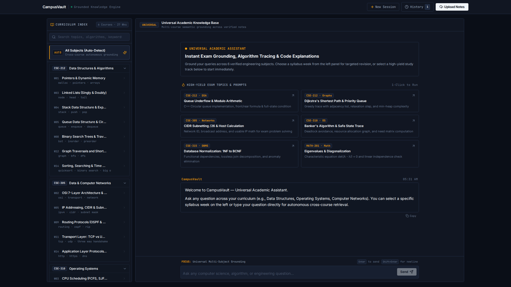
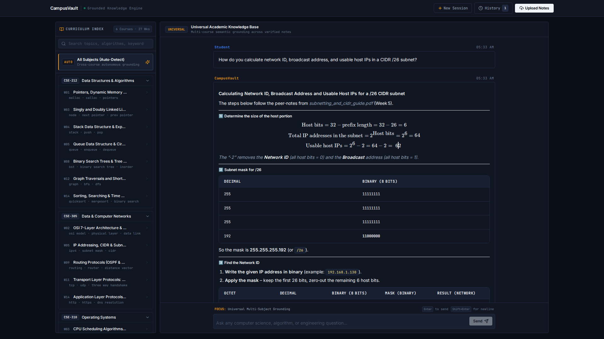
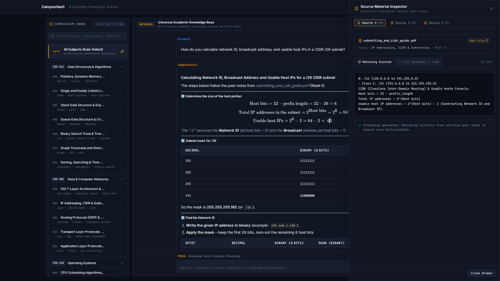
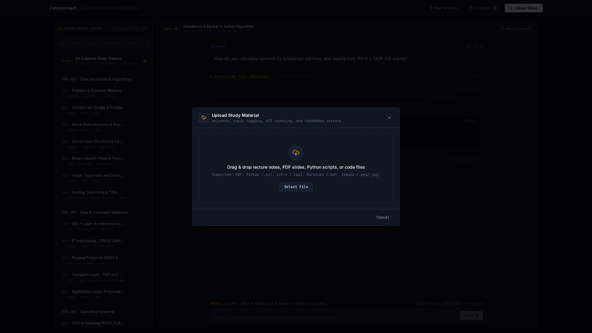
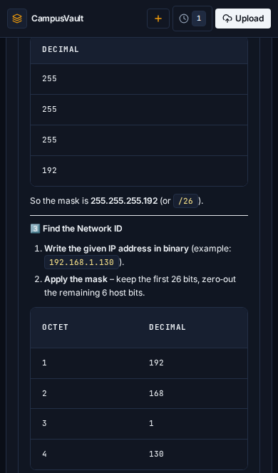
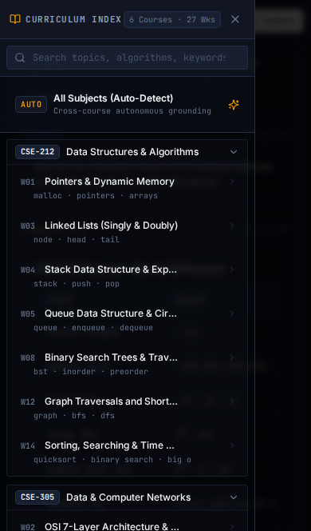

# 🎓 CampusVault — Agentic RAG Academic Knowledge Engine

<div align="center">

[](https://frontend-nine-tau-84.vercel.app)
[](https://fastapi.tiangolo.com)
[](https://reactjs.org/)
[](https://github.com/pgvector/pgvector)
[](https://groq.com)
[](LICENSE)

**Grounded Academic Intelligence · Zero-Hallucination Exam Prep · Peer Knowledge Preservation**

*Built for the HEC × Pak Angels GenAI & Agentic RAG Hackathon 2026*

[Explore Live Workstation](https://frontend-nine-tau-84.vercel.app) · [View API Docs](https://campusvault-backend.onrender.com/docs) · [Presentation Script](docs/script.txt)

</div>

---

## 📌 Executive Summary

Every semester, engineering undergraduates face an unspoken reality: **the knowledge required to clear viva exams, midterm derivations, and lab practicals lives in senior notebooks, whiteboard photos, and scattered WhatsApp drives—not in generic textbook AI.**

When students query standard models like ChatGPT, they encounter:
- ❌ **Hallucinated Syntax & Formulas**: Fabricated equations that violate specific course rubrics.
- ❌ **Zero Course Grounding**: Generic answers with zero awareness of university syllabi or lab environments.
- ❌ **No Proof of Source**: Inability to verify if an answer is mathematically sound.

**CampusVault** solves this with an end-to-end **Agentic RAG Engine** that maps verified peer study materials, lab implementations, and past exam solutions directly to a 16-week semester curriculum.

---

## 📸 Product Walkthrough & Screenshots

<div align="center">

### Desktop Engineering Workstation

*High-yield exam launchpad with 6 engineering subjects, 16-week timeline, and autonomous routing.*

</div>

<br>

<div align="center">

| Grounded RAG Answer with KaTeX | Source Material Inspector | AST Ingestion & Peer Upload |
|:---:|:---:|:---:|
|  |  |  |
| *Step-by-step binary math with KaTeX LaTeX rendering and route verification tags.* | *Traceable peer provenance with similarity scores, week tags, and original text.* | *Multi-format ingestion (PDF, C++, Python, Markdown) with automated AST chunking.* |

</div>

<br>

<div align="center">

| Mobile Workstation View | Mobile Curriculum Slideout |
|:---:|:---:|
|  |  |
| *Responsive mobile exam workstation with real-time SSE streaming.* | *Slide-out 16-week syllabus timeline for focused exam revision.* |

</div>

---

## 🧠 Why CampusVault is Agentic RAG (Not Naive RAG)

```
┌─────────────────────────┐       ┌─────────────────────────┐       ┌─────────────────────────┐
│        Naive RAG        │       │      Advanced RAG       │       │  Agentic RAG (CampusVault)│
├─────────────────────────┤       ├─────────────────────────┤       ├─────────────────────────┤
│ • Flat vector search    │       │ • Hybrid search (BM25)  │       │ • Autonomous Query Router│
│ • Fixed character split │  ──►  │ • Re-ranking pass       │  ──►  │ • AST-Aware Code Splitter│
│ • No confidence check   │       │ • Prompt engineering    │       │ • Confidence Gate (>=.65)│
│ • Blind context paste   │       │ • Metadata filtering    │       │ • Bilingual Adaptation   │
└─────────────────────────┘       └─────────────────────────┘       └─────────────────────────┘
```

### 1. Autonomous Query Router & Planner
Instead of executing a naive keyword search, the **Agentic Router** analyzes intent, classifies the engineering discipline (OS, Networks, DSA, DBMS, Digital Logic, Applied Math), and identifies the syllabus week number to plan targeted retrieval.

### 2. Confidence Gating (`score >= 0.65`)
If the retrieved cosine similarity drops below threshold (0.65), CampusVault **explicitly informs the student** that it is running in *General Parametric AI Mode* rather than fabricating false citations from notes.

### 3. AST-Aware & LaTeX-Preserving Chunking
Unlike standard splitters that cut text arbitrarily every 500 characters, CampusVault parses code structure via AST (Abstract Syntax Tree) to respect function boundaries in C++/Python and preserves entire LaTeX equation blocks.

### 4. Bilingual Code-Switching (Roman Urdu + English)
Understands and adapts to the natural conversational style of Pakistani university students (*"Bhai rear pointer overflow kab hoga?"*), grounding technical explanations in familiar vocabulary.

---

## ⚙️ High-Level System Architecture

```
                                      [ Student Query ]
                                              │
                                              ▼
                                 ┌─────────────────────────┐
                                 │   React UI (Vercel)     │
                                 └────────────┬────────────┘
                                              │ HTTPS / SSE
                                              ▼
                                 ┌─────────────────────────┐
                                 │ FastAPI Backend(Render) │
                                 └────────────┬────────────┘
                                              │
                     ┌────────────────────────┴────────────────────────┐
                     ▼                                                 ▼
        ┌─────────────────────────┐                       ┌─────────────────────────┐
        │  Agentic Query Router   │                       │   FastEmbed ONNX CPU    │
        │  • Subject Classifier   │                       │  • 384-dim Dense Vector │
        │  • Week Planner         │                       │  • Sub-10ms Local Run   │
        └────────────┬────────────┘                       └────────────┬────────────┘
                     │                                                 │
                     └────────────────────────┬────────────────────────┘
                                              │
                                              ▼
                                 ┌─────────────────────────┐
                                 │ PostgreSQL + pgvector   │
                                 │ • Cosine Distance (ANN) │
                                 │ • Hybrid Lexical Search │
                                 └────────────┬────────────┘
                                              │
                                              ▼
                                 ┌─────────────────────────┐
                                 │ Confidence Gate (>=.65) │
                                 └────────────┬────────────┘
                                              │
                     ┌────────────────────────┴────────────────────────┐
                     │ [Grounded Context]                              │ [General Mode Flag]
                     ▼                                                 ▼
        ┌───────────────────────────────────────────────────────────────────────────┐
        │                   Groq Llama 3.3 70B Versatile Engine                     │
        │                  • Low Temperature (0.1) Grounding                        │
        │                  • Real-Time Server-Sent Events (SSE)                     │
        └─────────────────────────────────────┬─────────────────────────────────────┘
                                              │
                                              ▼
                                 ┌─────────────────────────┐
                                 │ KaTeX Math + Citations  │
                                 └─────────────────────────┘
```

---

## 🛠️ Technology Stack

| Layer | Technology | Details / Purpose |
|---|---|---|
| **Frontend** | React 18, TypeScript, Vite, Tailwind CSS | High-contrast dark engineering blueprint UI (`#0A0E17`), Lucide icons |
| **Backend** | FastAPI (Python 3.14) | Async REST API, SSE streaming endpoints, multi-subject syllabus routers |
| **LLM Inference** | Groq Llama 3.3 70B Versatile | Ultra-low latency token generation (<500ms TTFT) |
| **Embeddings** | FastEmbed (`BAAI/bge-small-en-v1.5`) | 384-dimensional vectors running on local ONNX CPU runtime (<180MB RAM) |
| **Vector DB** | Supabase (PostgreSQL + pgvector) | Cosine similarity vector search with custom RPC filtering |
| **OCR & Parsing** | `pdfplumber` + Gemini 2.5 Flash | Tiered parsing: local digital extraction with fallback cloud OCR for handwriting |
| **Math & Code** | KaTeX + PrismJS | Real-time mathematical LaTeX rendering and syntax highlighting |
| **Deployment** | Vercel & Render | Production multi-region edge deployment with automated CI/CD |

---

## 🚀 Quickstart & Local Setup

### Prerequisites
- Node.js >= 18.x
- Python >= 3.11
- PostgreSQL with `pgvector` extension (or free Supabase project)
- Groq API Key (from [console.groq.com](https://console.groq.com))

---

### 1. Clone Repository
```bash
git clone https://github.com/Ilyan321/campusvault.git
cd campusvault
```

---

### 2. Backend Setup
```bash
cd backend

# Create and activate virtual environment
python -m venv .venv
source .venv/bin/activate  # On Windows: .venv\Scripts\activate

# Install dependencies
pip install -r requirements.txt

# Configure environment variables
cp .env.example .env
```

Edit `backend/.env`:
```env
GROQ_API_KEY=gsk_your_groq_api_key_here
SUPABASE_URL=https://your-project.supabase.co
SUPABASE_KEY=your_supabase_anon_key
SUPABASE_SERVICE_ROLE_KEY=your_supabase_service_role_key
```

Run backend server:
```bash
uvicorn main:app --reload --port 8000
```
Backend API will be live at `http://localhost:8000` (Docs at `http://localhost:8000/docs`).

---

### 3. Frontend Setup
```bash
cd ../frontend

# Install dependencies
npm install

# Start local development server
npm run dev
```
Frontend workstation will be live at `http://localhost:5173`.

---

## 📡 Core API Endpoints

| Method | Endpoint | Description |
|---|---|---|
| `GET` | `/health` | Healthcheck and database connectivity status |
| `POST` | `/api/query` | Standard RAG query endpoint with context citations |
| `POST` | `/api/query/stream` | Agentic RAG streaming endpoint (Server-Sent Events) |
| `POST` | `/api/upload` | Uploads notes/code, performs AST chunking and vector indexing |
| `GET` | `/api/syllabus` | Returns 16-week curriculum syllabus across 6 engineering subjects |
| `GET` | `/api/sources/{id}` | Retrieves full original source document and metadata |

---

## 👥 Team Members

Midterm Hackathon project developed for the **Pak Angels × HEC GenAI Course**:

| Member | Role / Department |
|---|---|
| **Shahzaib Ali** | Team Lead & Fullstack Development |
| **Ali Hussain** | RAG Architecture & Vector Indexing |
| **Aqsa Sarfaraz** | Dataset Curation & Syllabus Alignment |
| **Arfa Rehman** | Prompt Engineering & QA Verification |
| **Zainab Faiz** | Frontend UI/UX & Responsive Design |
| **Warda Nadeem** | Testing & Technical Documentation |

---

## 📄 License

This project is licensed under the **MIT License** — see the [LICENSE](LICENSE) file for details.

---

<div align="center">

**[CampusVault](https://frontend-nine-tau-84.vercel.app) — Empowering Engineering Students with Grounded AI.**

</div>
